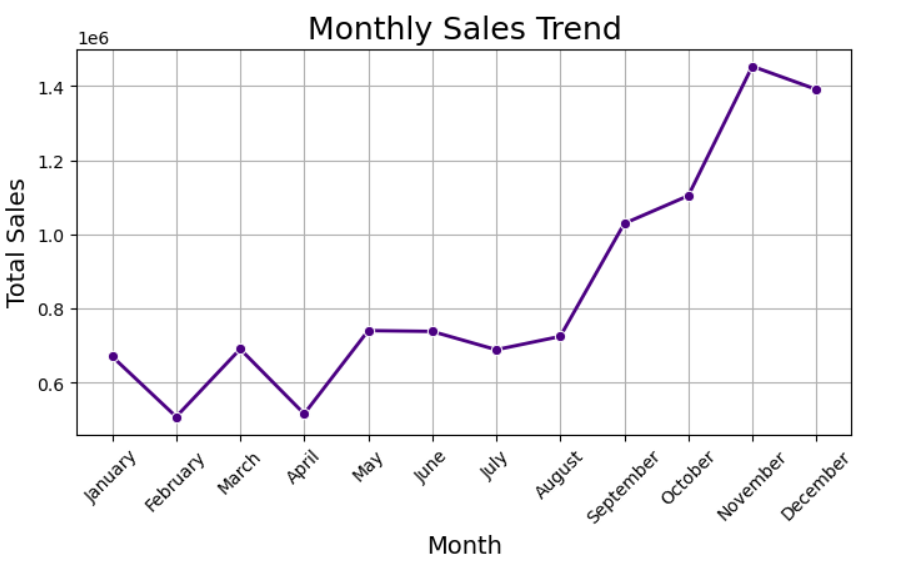
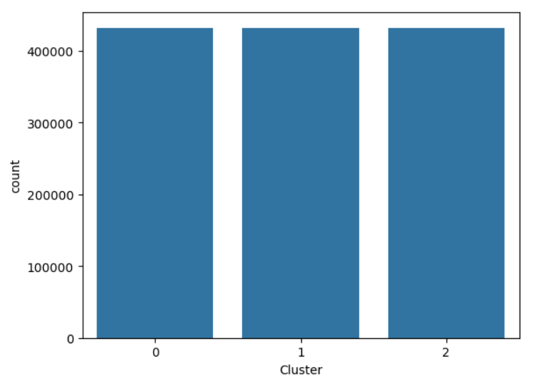

# ONLINE RETAIL SALES FORECAST AND CLUSTERING

## OVERVIEW
This project aims to develop a predictive model that classifies online retail transactions into specific categories and clusters. The insights from this model will help in identifying hidden patterns, optimizing inventory management, improving customer segmentation, and enhancing sales forecasting.

## OBJECTIVES
- **Predictive Modeling:** To develop a classification model to categorize transactions based on purchasing behavior.
- **Clustering Analysis:** To identify customer and product segments using clustering techniques.
- **Feature Engineering:** To create meaningful features from transactional data to improve model accuracy.
- **Sales Forecasting:** To use historical data to predict future sales trends.
- **Customer Segmentation:** To group customers based on their purchasing behavior for targeted marketing campaigns.

## RESEARCH GOALS
**Exploratory Data Analysis (EDA)**
- Perform summary statistics and trend analysis.
- Visualize key trends such as top-selling products and purchasing patterns.

**Predictive Classification Model**
- Develop a machine learning model to classify transactions.
- Analyze feature importance to understand key drivers of purchasing behavior.

**Clustering Analysis**
- Apply clustering techniques to identify distinct customer groups.
- Visualize and interpret clusters to gain actionable business insights.

**Sales Forecasting Model**
- Implement time series forecasting to predict future sales trends.
- Evaluate forecast accuracy and derive insights for business decision-making.

**Customer Segmentation Report**
- Identify key customer segments based on purchasing behavior.
- Provide recommendations for targeted marketing strategies.

## METHODOLOGY
1. **Data Collection**
Gathered transactional data from an online retail platform. The data included details like customer ID, Stock code, Invoice date, product description, quantity, unit price, and country.
2. **Data Preprocessing**
Handled missing values and outliers, converted date-time features into meaningful formats, normalized and scaled numerical features for model training.
3. **Exploratory Data Analysis (EDA)**
Generated summary statistics (mean, median, mode, etc.) and visualized sales trends, top-selling products, and customer purchase behavior.
4. **Feature Engineering**
Created new features like purchase frequency, average spend, and recency of last purchase and categorized products and customers based on spending patterns.
5. **Predictive Classification Model**
Trained a machine learning model to classify transactions based on purchasing behavior and evaluated model performance using accuracy, precision, recall, and F1-score.
6. **Clustering Analysis**
Applied clustering techniques (e.g., K-Means) to segment customers and products and also visualized interpreted clusters to identify purchasing patterns.
7. **Sales Forecasting**
Used time series models (Prophet) to predict future sales trends and also evaluated forecast accuracy with metrics like RMSE and MAPE.
8. **Customer Segmentation**
Grouped customers based on their purchasing habits (e.g., Low purchase customers, Moderate purchase customers, and high purchase customers
9. **Product Segmentation**
Grouped products based on how often they are purchased (e.g., Best Selling products, Low selling products and moderate selling products.

## TOOLS USED
Python, Jupyter Notebook, Pandas, NumPy, Matplotlib & Seaborn, Scikit-learn, XGBoost, Facebook Prophet, Resampling (from Scikit-learn), LabelEncoder & OrdinalEncoder, Winsorization

## ANALYSIS AND INSIGHTS
### 1. EXPLORATORY DATA ANALYSIS (EDA)
**Top 10 Products**

The bar chart shows the Top 10 Best Selling Products based on total sales. The chart revealed that REGENCY CAKE STAND 3 TIER and PAPER CRAFT LITTLE BIRDIE are the highest selling products, both having over 150000 sales.

### Sales Trend Analysis

**i. Quarterly Sales Trend**

The chart revealed that Q4 (Oct-Dec) has the highest sales
Each quarter shows an increase in sales, meaning business performance improves over time.
Q1 has the lowest sales, which is common because consumers often reduce spending after the holidays

**ii. Monthly Sales Trend**

The chart reveals that November has the highest sales. While still high, December sees a slight drop compared to November. 
September to November also show an upward trend, possibly due to back-to-school or pre-holiday sales.
The overall trend suggests a gradual increase from mid-year, peaking in December.

**iii. Daily Sales Trend**

Thursday has the highest sales, suggesting it's the peak shopping day. It could be due to special promotions, payday shopping, or weekly discounts
The sales are relatively stable from Monday to Wednesday but increase significantly on Thursday.
Sales drop sharply on Friday and hit the lowest point on Saturday.

**iv. Periodic Sales Trend**

The chart reveals that Sales peak in the Afternoon, indicating that most transactions occur during this period.
Morning sales are moderate, showing steady activity but lower than the afternoon peak.
Sales decline sharply in the evening and reach the lowest point at night. The drop might be that people might be engaged in other activities such as socializing or relaxing while the low night sales might be due to rest of fewer promotional campaigns

### 2. CLUSTERING ANALYSIS FOR CUSTOMER SEGMENTATION

The chart reveals how customers behave based on Recency (when last they made a purchase) and Frequency (how often they buy).

**Customer Segment**

**Green (High purchase):** These are customers who buy frequently and tend to make purchases recently.

**Orange (Moderate Purchase):** They buy occasionally but are still engaged

**Blue (Low Purchase):** These customers haven’t bought in a long time and also don’t purchase often.

Based on the chart, Customers who buy often tend to come back quickly (green cluster). Some customers buy occasionally and have moderate recency (Orange cluster), while many customers haven't bought in a long time and don’t buy often (Blue cluster)

**Segment Distribution**

Moderate Purchasers: 426,851 (Largest group)

Low Purchasers: 52,599

High Purchasers: 40,534

The majority of customers fall into the "Moderate Purchase" category, with a smaller portion classified as "High Purchase."

### CLUSTERING FOR PRODUCT SEGMENTATION

The chart reveals how customers behave based on Recency (when last they made a purchase) and Frequency (how often they buy).

**Product Segment**

**Green (High purchase):** These are Products that are frequently sold.

**Orange (Moderate Purchase):** These are sold occasionally.

**Blue (Low Purchase):** These products haven’t been bought in a long time and also aren’t purchased often.

**Segment Distribution**

### 3.  PREDICTIVE MODELLING FOR CLASSIFICATION

A machine learning model was built using XGBoost to classify customers based on purchasing behavior.

**Model Performance**

F1 Score: 0.99

Recall Score: 0.99

The model demonstrated excellent performance in accurately classifying transactions. Based on the F1-score and Recall-score displayed for the different models, the best model would ideally be the one with the highest scores: Random Forest, XGBoost, and Decision Tree, nevertheless I choose XGboost (xg) because it tends to generalize better compared to others and also handles large datasets well and reduces overfitting using boosting.

### 4. FEATURE IMPORTANCE

**For Customer Segment**

**Top Contributing Features:**

The charts show which factors (features) are most important when predicting customer behavior using XGBoost model. The Longer the bar, the more important the feature.
The chart revealed that Monetary Value (Most important Feature) i.e how much money a customer spends plays a biggest role in predictions. High spending customers are more valuable, so this feature helps in customer segmentation

Monetary Value (49.9% importance)

Recency (42.6% importance)

Frequency (2.0% importance)

**Key Insights**
The total amount spent (Monetary Value) is the strongest predictor of purchasing behavior.
Customers who made recent purchases are more likely to belong to higher purchase segments.
Frequency played a lesser role, indicating that purchase volume alone isn’t as strong an indicator as recency and spending power.

**Handling Class Imbalance**

The initial distribution of clusters showed a significant imbalance.
To ensure the model does not favor any particular class, resampling techniques were applied to balance all clusters.
The balanced dataset resulted in more equitable classification performance across different customer groups.

**Feature Importance for Product Segment**

Recency (how recently a product is sold) is the strongest predictor.

### 5. SALES FORECASTING
The future sales trends were forecasted based on historical data using Facebook Prophet.

**Model Performance**

Mean Absolute Error (MAE): 22,613.51

The Mean Absolute Error (MAE) measures the average difference between the actual sales values and the predicted values by the mode. An MAE of 22,613.51 means that, on average, the model sales predictions differ from the actual sales by about 22,613 units.
The model accuracy in prediction depends on the scale of the data:
If total sales are in millions, an error of 22,613 might not be significant. but if the total sales are much smaller, this error is quite large, meaning the model's predictions are not very accurate.
Thus, looking at the Total Sales of the business in the past years, 2010 amounted to a total sale of 776,240.91, and in 2011, it increased significantly to a total sale of 9,478,095.
Relative to 2010 Sales, an average error of 22,613 is roughly 3% of 776K, while relative to 2011 sales (9.48M), an average error of 22,613 is about 0.24% of 9.48M. 
Hence, we can conclude that on an annual scale, the model seems reasonably accurate because 22K is a small fraction compared to millions in total sales.
.

## BUSINESS IMPLICATIONS AND RECOMMENDATIONS

**A. Inventory Management**
- Given the dominance of the Moderate Purchase segment, inventory should be optimized to match this customer group’s buying behavior.
- Seasonal spikes in sales suggest strategic stocking before high-demand periods to prevent stockouts.

**B. Customer Segmentation for Marketing**

**High Purchase Segment**
- Personalized marketing and loyalty programs can further enhance engagement.
- Offers such as premium memberships or exclusive discounts can drive repeat high-value transactions.

**Moderate Purchase Segment**
- This group forms the largest share and represents the biggest opportunity for revenue growth.
- Targeted promotions and incentives can help convert them into high-value customers.

**Low Purchase Segment**
Introduce discounts, free trials, or bundled offerings to encourage purchases.

**C. Sales Growth Strategy**

**Leverage Predictive Insights:**
- Use sales forecasting to align marketing campaigns with expected peaks.
- Allocate advertising budgets efficiently by focusing on periods with high projected sales.

**Data-Driven Decision Making:**
- Regularly update models to capture emerging trends.
- Expand feature engineering to incorporate additional factors such as customer demographics and external market conditions.

## CONCLUSION
This analysis provided a robust framework for customer segmentation, predictive modeling, and sales forecasting. The insights gained can drive data-informed business strategies, improving customer engagement and revenue growth.
By continuously refining our models and incorporating additional data points, we can further enhance prediction accuracy and uncover deeper business opportunities.

## Team Members
- Kudimfon Paul
- Osita Emmanuel
- Harrison Ebipre
- Chinaemelum Ndidi_Chukwuka
- 
### Jupyter Notebook for the Analysis and Coding Procedures:

Customer segmentation (1).ipynb

Product segmenntation.ipynb

